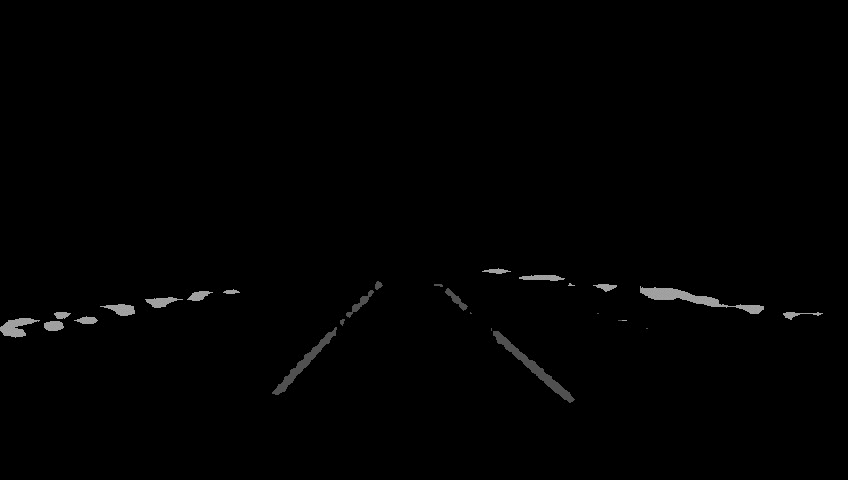
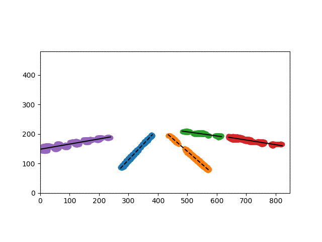

This repo(<150 lines) uses BFS and MSE to fit the lane location from the segmentation results of images.

In specific, 
- BFS is for clustering(grouping) the segmentation pixels of each single lane
- MSE is to fit the line slope and intercept of each lane

segmentation results

lane fitting results
